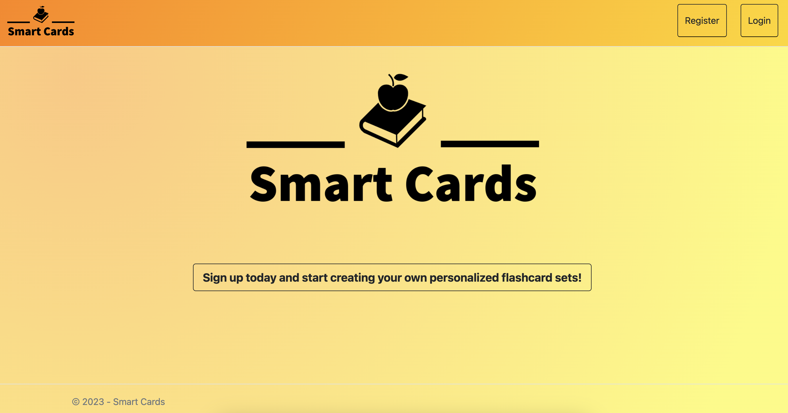
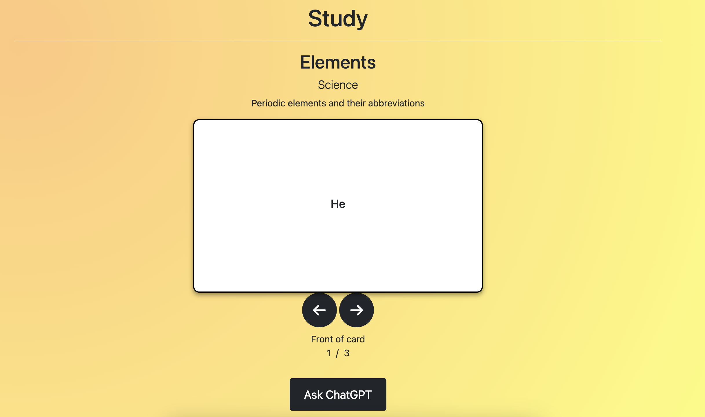
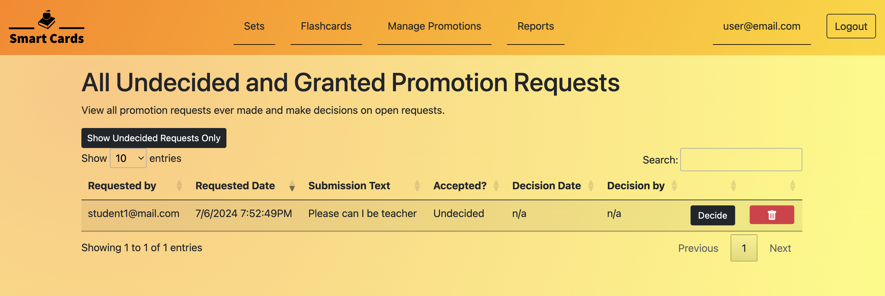
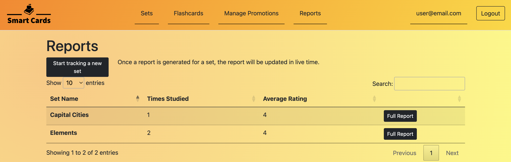
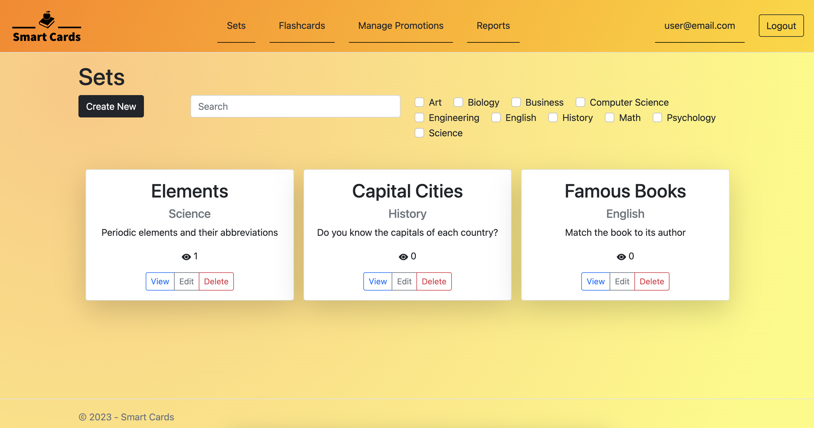

# SmartCards
Developers:
- Sid Elkins
- Tyler Shipley
- Zach Stumpf
- Cade Sweeney

The University of Alabama



## Description
Smart Cards is a C# ASP.NET MVC website that enables students to view flashcard sets generated by their teachers and use ChatGPT to help them study terms. The website provides an interactive and efficient way for students to study and review important concepts, with the added benefit of having a powerful AI language model available to assist them in answering questions and clarifying any confusion. Teachers also have the ability to view reports about sets, including views, ratings, and comments.

# Screenshots









# Install

At one point, the website and database were hosted by Azure, but for now the project is archived. It uses a SQLite server, and the AI functionality doesn't work because that needs a paid API key. But, you can still play around with it and get the general idea.

```sh
git clone https://github.com/zgstumpf/smartcards.git
cd smartcards
dotnet run
```

You may need to install some dotnet dependencies.

Search https://localhost:7175 in your browser

Make an account on the website (email doesn't need to be real)

By default, new users are students. Other teachers can promote a student to a teacher. Since there are no teachers yet, you have to manually make yourself a teacher to get things started.

Open smartcards-dev.sqlite in a SQLite explorer and get your user id from AspNetUsers table and the id for the teacher role from AspNetRoles table. Then run:

```sql
insert into AspNetUserRoles
values
("your-user-id", "teacher-role-id")
```

Refresh the website and you should be a teacher.